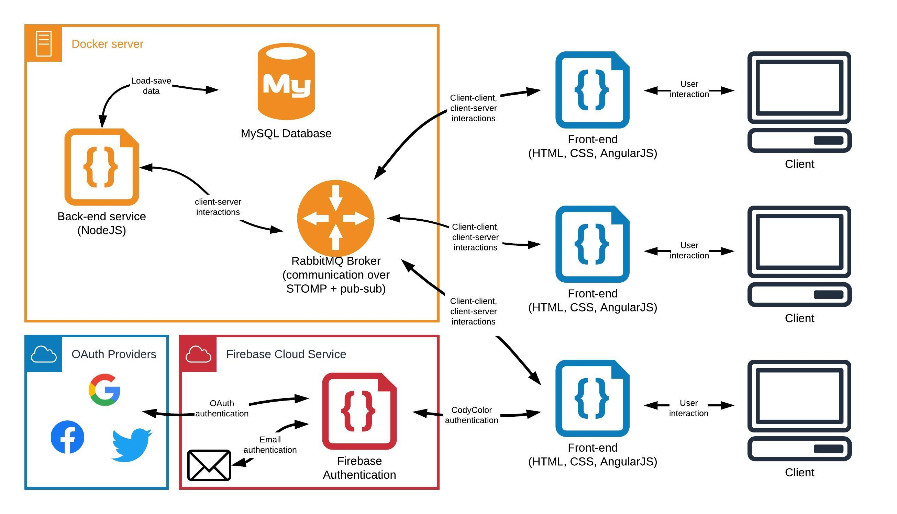
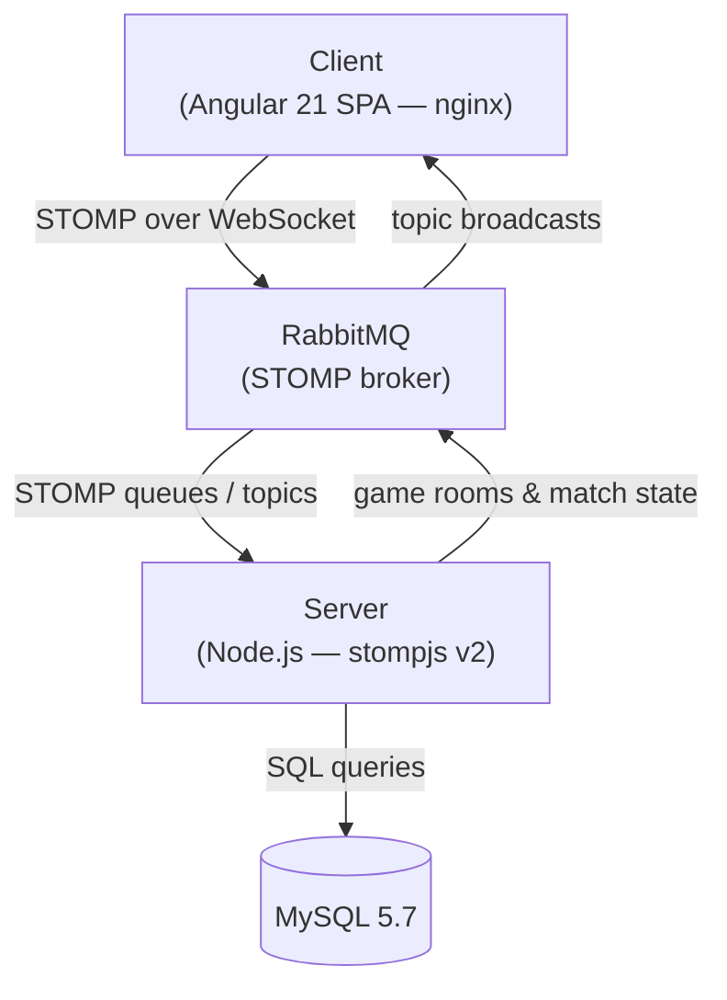

# CodyColor

<p align="center">
  
</p>

[CodyColor Multiplayer](https://codycolor.codyroby.it) is an educational coding
game developed by [Digit SRL](https://digit.srl), inspired by the unplugged
coding method **CodyColor**. It teaches computational thinking through a
multiplayer, grid-based game where players program a robot's path to reach a
target — competing in real time against other players or against the bot.
Learn more on the [Digit blog](https://digit.srl/codycolor-multiplayer-learn-by-having-fun/).

The game supports three match modes:

| Mode      | Description                                                          |
| --------- | -------------------------------------------------------------------- |
| **Arcade** | Practice against the bot — single player, no time pressure         |
| **Random** | Matchmaking with random opponents on shared game rooms             |
| **Royale** | Battle-royale-style multi-round elimination tournament             |

---

## Architecture

CodyColor is a full-stack real-time application with four cooperating
components, all orchestrated through Docker Compose:



1. **Client** (`client/`) — an Angular 21 single-page application using
   `@stomp/stompjs` to communicate with the message broker over WebSocket.
   Firebase Authentication handles user login. The production build runs
   inside an nginx container; the client's config (Firebase keys, RabbitMQ
   credentials, public URL) is injected at container startup via
   `window.__RUNTIME_CONFIG__`.

2. **Server** (`server/`) — a Node.js application (stompjs v2) that connects to
   RabbitMQ as a STOMP consumer. It manages game rooms (arcade, random, and
   royale), synchronizes match state between players, persists match results,
   user profiles, and rankings in MySQL, and enforces the game logic.

3. **RabbitMQ** — a STOMP-enabled message broker (`beevelop/rabbitmq-stomp`)
   that mediates all client ↔ server communication through named queues and
   topics.

4. **MySQL** — a relational database (`mysql:5.7`) storing users, match
   sessions, match participants, and scores. A phpMyAdmin container is
   included for inspection.

5. **Database Operator** (`database-operator/`) — an Alpine image bundling
   `mysql-client` and the schema/migration SQL files for initialising the
   database.

### Communication flow

The client never talks to the server directly. Instead, both the client and
the server are STOMP clients connected to the same RabbitMQ broker:

- The client publishes control messages to `/queue/serverControl` and
  subscribes to a per-session response queue.
- The server subscribes to `/queue/serverControl`, processes game logic, and
  broadcasts state updates on shared topics (`/topic/gameRooms`,
  `/topic/custGameRooms`, `/topic/agaGameRooms`, `/topic/general`).

### Runtime configuration

Secrets and environment-specific values are **never baked into the build**:

| Value               | Development                        | Production                          |
| ------------------- | ---------------------------------- | ----------------------------------- |
| Firebase config     | `client/src/environments/environment.ts` (gitignored) | `/firebase-config.json` volume mount |
| RabbitMQ credentials | `environment.ts`                  | `RABBIT_USERNAME` / `RABBIT_PASSWORD` env vars |
| RabbitMQ WebSocket URL | `environment.ts`              | `RABBIT_SOCKET_URL` env var          |
| Web base URL        | `environment.ts`                   | `WEB_BASE_URL` env var               |

In production, `client/entrypoint.sh` reads the mounted Firebase JSON and the
environment variables, then writes a `runtime-config.js` file into the nginx
web root. `index.html` loads it before Angular boots, making
`window.__RUNTIME_CONFIG__` available to `environment.prod.ts`.

---

## Repository layout

```
CodyColor/
├── client/                  # Angular 21 frontend (SPA)
│   ├── src/
│   │   ├── app/             # Components, pages, services
│   │   │   └── services/rabbit.service.ts   # STOMP connection layer
│   │   └── environments/    # environment.ts (dev, gitignored) / .prod.ts
│   ├── entrypoint.sh        # Runtime config injection (production)
│   ├── Dockerfile           # Multi-stage: build → nginx
│   └── nginx.conf
├── server/                  # Node.js backend
│   ├── app.js               # Entry point — message handlers & game logic
│   ├── communication/       # broker.js (STOMP), database.js (MySQL), logs.js
│   ├── gameRooms/           # Game room logic: random.js, custom.js, royale.js
│   ├── versions.js          # Required client version checks
│   └── Dockerfile
├── database-operator/       # Schema + migration SQL + mysql-client container
│   ├── create.sql           # Full initial schema
│   ├── migrations/         # Incremental migrations
│   ├── client.sh            # mysql CLI wrapper
│   └── Dockerfile
├── docker-compose.yml       # Production stack (Traefik, external volumes)
├── docker-compose.local.yml # Local development stack (exposed ports, guest creds)
├── config-template.env      # Template for config.env
├── firebase-config.example.json  # Template for Firebase config
├── Taskfile.yml             # Task runner shortcuts (go-task)
└── docs/                    # Component diagram, database operations
```

---

## Prerequisites

- [Docker](https://docs.docker.com/get-docker/) with the Docker Compose plugin
  (v2+)
- [Node.js](https://nodejs.org/) 22+ and npm (for local Angular development)
- [Go Task](https://taskfile.dev/) (optional — for the `task` shortcuts in
  `Taskfile.yml`; you can use `docker compose` directly instead)
- A [Firebase](https://console.firebase.google.com/) project with
  Authentication enabled (for local development you can use a test project)

---

## Quick start — run locally with Docker

This is the fastest way to get the full stack running. It uses
`docker-compose.local.yml`, which exposes RabbitMQ and MySQL on localhost with
guest credentials and includes phpMyAdmin.

### 1. Prepare configuration files

```bash
# Firebase config (use your own project's web config)
cp firebase-config.example.json firebase-config.json

# Edit firebase-config.json with your Firebase project's web config keys
# (apiKey, authDomain, projectId, appId, ...)

# Local config for the Angular dev environment
cp client/src/environments/environmentTemplate.ts client/src/environments/environment.ts
# Edit environment.ts — fill in your Firebase config and set:
#   rabbit.socketUrl: 'ws://localhost:15674/ws'
#   webBaseUrl: 'http://localhost:4200'
```

### 2. Start the infrastructure (RabbitMQ + MySQL + Server)

```bash
docker compose -f docker-compose.local.yml up -d
```

This starts:

| Service           | Port  | Purpose                         |
| ----------------- | ----- | ------------------------------- |
| `rabbit`          | 15674 | RabbitMQ STOMP WebSocket        |
|                   | 15672 | RabbitMQ management UI          |
| `database`        | 3306  | MySQL                           |
| `database-manager`| 8080  | phpMyAdmin (`root` / `root`)    |
| `server`          | —     | Node.js game server             |

### 3. Initialise the database

The server expects the schema from `database-operator/create.sql`. Apply it
via phpMyAdmin (open http://localhost:8080, log in with `root` / `root`,
select the `codycolor` database, and import `database-operator/create.sql`) or
with the mysql CLI:

```bash
docker compose -f docker-compose.local.yml exec database \
  mysql -u codycolor -pcodycolor codycolor < /docker-entrypoint-initdb.d/create.sql
```

> **Note:** If `create.sql` is not automatically loaded on first start, copy
> it into the database container and run it manually:
> ```bash
> docker compose -f docker-compose.local.yml cp database-operator/create.sql database:/create.sql
> docker compose -f docker-compose.local.yml exec database \
>   sh -c 'mysql -u codycolor -pcodycolor codycolor < /create.sql'
> ```

### 4. Start the Angular dev server

```bash
cd client
npm install
npm start
```

Open http://localhost:4200 — the app will connect to the local RabbitMQ
instance on port 15674 and the Node.js server will handle game logic.

---

## Quick start — full Docker stack (production-like)

To run everything (including the built client served by nginx) in Docker,
use the production compose file. This requires an external Docker network
named `web` and the `config.env` file.

```bash
# Create the external network (only once)
docker network create web

# Prepare production config
cp config-template.env config.env
# Edit config.env with your RabbitMQ credentials, MySQL credentials,
# and public URLs (RABBIT_SOCKET_URL, WEB_BASE_URL)

# Start all services
docker compose up -d website server rabbit database database-client
```

Or use the Taskfile shortcuts (requires [Go Task](https://taskfile.dev/)):

```bash
task up        # start website + server (detached)
task rebuild   # rebuild and recreate all services
task ps        # show running containers
task stop      # stop all services
task rm        # force-remove all containers
```

The production stack is configured for deployment behind [Traefik 3](https://traefik.io)
with automatic HTTPS and domain-based routing. See `docker-compose.yml` for the
full Traefik label configuration.

---

## Local development (without Docker for the client)

If you only want to develop the Angular frontend while the backend services
run in Docker:

```bash
# 1. Start infrastructure
docker compose -f docker-compose.local.yml up -d rabbit database server

# 2. Set up the Angular dev environment
cd client
cp src/environments/environmentTemplate.ts src/environments/environment.ts
npm install
npm start          # ng serve — http://localhost:4200, hot reload enabled
```

For the client dev environment (`environment.ts`), point the RabbitMQ
WebSocket URL at the local broker:

```typescript
export const environment = {
  production: false,
  firebaseConfig: {
    apiKey: '<your-firebase-apiKey>',
    authDomain: '<your-project>.firebaseapp.com',
    databaseURL: 'https://<your-project>.firebaseio.com',
    projectId: '<your-project>',
    storageBucket: '<your-project>.appspot.com',
    messagingSenderId: '<your-sender-id>',
    appId: '<your-app-id>',
  },
  rabbit: {
    username: 'guest',
    password: 'guest',
    vHost: '/',
    socketUrl: 'ws://localhost:15674/ws',
  },
  webBaseUrl: 'http://localhost:4200',
};
```

### Useful npm scripts (in `client/`)

| Command       | Description                              |
| ------------- | ---------------------------------------- |
| `npm start`   | Dev server with live reload (`ng serve`) |
| `npm run build` | Production build → `dist/`             |
| `npm run watch` | Build + watch for changes              |
| `npm test`    | Unit tests (Karma + Jasmine)             |

---

## Deployment

The application is deployed at **https://codycolor.codyroby.it** behind Traefik 3.
The legacy domain `codycolor.codemooc.net` is automatically redirected.

Production services defined in `docker-compose.yml`:

| Service             | Description                                    |
| ------------------- | ----------------------------------------------- |
| `website`           | Angular client (nginx) — built from `client/`  |
| `server`            | Node.js game server — built from `server/`      |
| `rabbit`            | RabbitMQ STOMP broker                           |
| `database`          | MySQL 5.7                                       |
| `database-client`   | One-shot schema initializer                     |
| `database-manager`  | phpMyAdmin (web UI at `/phpmyadmin/`)          |

### Environment variables (`config.env`)

See `config-template.env` for the full list:

| Variable               | Used by   | Description                           |
| ---------------------- | --------- | ------------------------------------- |
| `MYSQL_USER`           | server    | MySQL application user                |
| `MYSQL_PASSWORD`       | server    | MySQL application password            |
| `MYSQL_DATABASE`       | server    | MySQL database name                   |
| `MYSQL_ROOT_PASSWORD`  | database  | MySQL root password                   |
| `RABBIT_USERNAME`      | website   | RabbitMQ STOMP username               |
| `RABBIT_PASSWORD`      | website   | RabbitMQ STOMP password               |
| `RABBIT_VHOST`         | website   | RabbitMQ virtual host                 |
| `RABBIT_SOCKET_URL`    | website   | Public WebSocket URL for STOMP        |
| `WEB_BASE_URL`         | website   | Public base URL of the application    |

The Firebase web config is mounted as a volume (`firebase-config.json`) and
injected at container startup — see `client/entrypoint.sh`.

---

## Tech stack

| Layer       | Technology                                              |
| ----------- | ------------------------------------------------------- |
| Frontend    | Angular 21, TypeScript, Tailwind CSS 4, Angular Material |
| Auth        | Firebase Authentication (`@angular/fire`)               |
| Messaging   | `@stomp/stompjs` (client) / `stompjs` v2 (server)       |
| Backend     | Node.js (stompjs v2), MySQL 5.7                         |
| Broker      | RabbitMQ with STOMP plugin (`beevelop/rabbitmq-stomp`)  |
| Web server  | nginx (production client)                              |
| Reverse proxy | Traefik 3 (production)                               |
| Orchestration | Docker Compose, Taskfile                              |

---

## License

[MIT](LICENSE) — Copyright 2019 DIGIT srl.

## Contributors

- [Riccardo Maldini](https://github.com/maldins46)
- [Miriam Petrocchi](https://github.com/miris-mp)
- [Lorenz Cuno Klopfenstein](https://github.com/LorenzCK)

Developed by [Digit SRL](https://digit.srl) as part of the CodeMOOC project.
