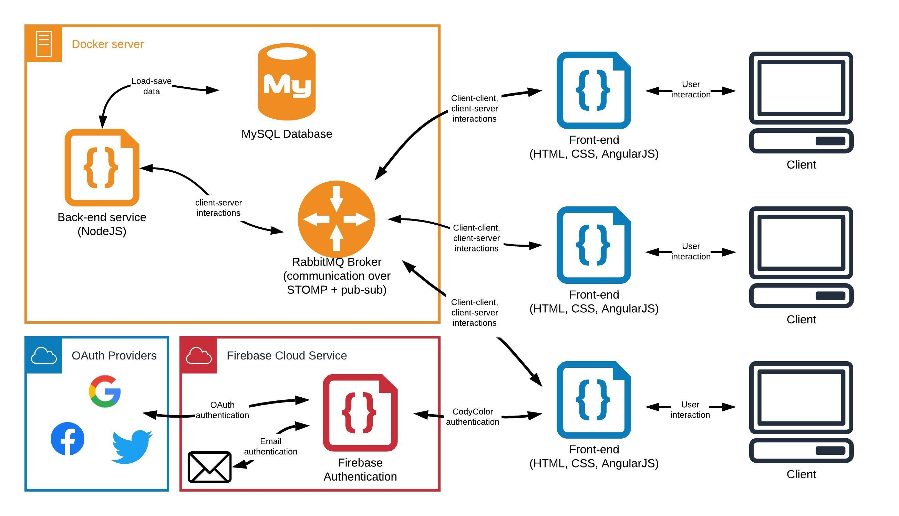

# CodyColor front-end service

[CodyColor Multiplayer](https://codycolor.codemooc.net/#!/) is an educational game developed by Digit S.r.l., inspired by the unplugged coding method **CodyColor**. Additional information about the game can be found in the [Digit blog](https://digit.srl/codycolor-multiplayer-learn-by-having-fun/). The software infrastructure on which the game is based is based on two main components:

* the **back-end**, composed by a [message broker and a NodeJS executable](https://github.com/digit-srl/CodyColorServer); all the back-end code is contained and handled in a Docker infrastructure;
* the **font-end**, composed by a web app developed on the AngularJS framework.



This repository includes all the files that form the front-end system of the game.


## Source code organization

The front-end of the game is essentially a cross-platform, single-page web app, built following PWA specifications. The website becomes dynamic thanks to the JavaScript code, all contained inside the ```/js``` folder. The code is completely modular, and built over the AngularJS framework.

Every section of the web app is handled by an AngularJS **controller** file. All controllers are positioned inside the ```/js/controllers``` folder. Ths various features expressed by the code are grouped using AngularJS **factories**. In the practice of this app, every factory actually represents a different **code module**. Every module is then used by different controllers and by other modules.

The code is organized in a Docker container, so as to make it easier to start up the front end. Once the container is installed in the Docker environment, it is sufficient to execute the command to set the PWA working:

```bash
make rebuild
```

The actual source of the PWA, abstracting from the configuration and docking, is contained in the ``src/conents`` sub-directory. Inside, the code is organized as follows:

```bash
audio/ *
bower_components/ 
build/ *
css/
fonts/ *
icons/ *
img/ *
js/
locales/ *
node_modules/
pages/ *
static/ *
browserconfig.xml *
favicon.ico *
gruntfile.js 
humans.txt *
index.html *
manifest.json *
package.json
package-lock.json
robots.txt *
service-worker.js *
site.webmanifest *
src-service-worker.js
workbox-config.js
```

Files and folders marked with an asterisk must be uploaded to the web space at the end of the deployment phase, while the others are used for auxiliary purposes, and for development.

The source code was created based on [HTML5 Boilerplate](https://html5boilerplate.com/). A description of the boilerplate components can be found on their website.

The external libraries used by PWA are managed through the package manager **Bower**. To install an external library supported by the package manager, the commands must be executed in sequence

```bash
bower install <package> --save
grunt update_dependencies
```

You must have previously installed Node. The second command uses a Grunt task that saves the essential code of the project's external libraries in a single file inside ```js/vendor```. This is necessary for the deployment phase, described in the following paragraphs.

## Deployment

For each new release (stable or in beta), a particular deployment procedure must be followed, which allows file compression, code obfuscation and correct updating of files in client-side cache. It is essential to perform the appropriate procedure, divided into two parts to make the CodyColor client work properly.

### 1. Allow client-side update
To make the update operational in each terminal that uses CodyColor, it was necessary to use the features provided by the **service worker**. A service worker is a thread associated with a particular website, which remains active in the browser even if the site tab is closed. This functionality is used in CodyColor both to make the site a PWA (service workers are the base for PWA, making the site features available offline), and to allow CodyColor code and features to be easily updated for each new release, through the features offered by [Workbox](https://developers.google.com/web/tools/workbox/) and [Workbox CLI](https://developers.google.com/web/tools/workbox/guides/generate-service-worker/cli). In this configuration, when an update is ready for deployment, you will need to increase the version number reported in ```js/sessionHandler.js```, then execute the command

```bash
workbox injectManifest workbox-config.js 
```


### 2. Compression, minification and obfuscation
Second phase of the deployment is the execution of a Grunt task that allows to compress, minify and obfuscate the JavaScript and CSS code of the app. With this procedure, all the JavaScript code used by the app is aggregated and minified. A similar procedure is carried out for the CSS. You need to have Node installed, then type this command in the ```/src/contents``` directory:

```bash
grunt build
```
The task will generate inside the ```/build``` directory the files ```app.min.js``` and ```app.min.css```, used by the app in production.
